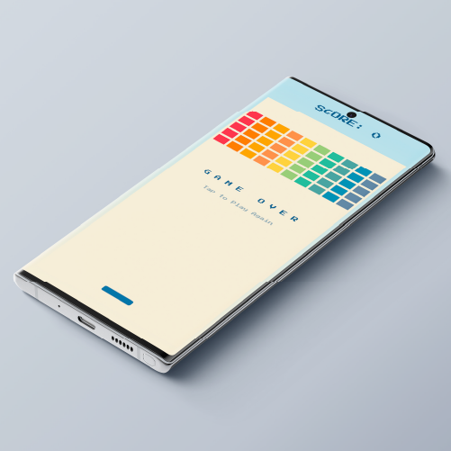
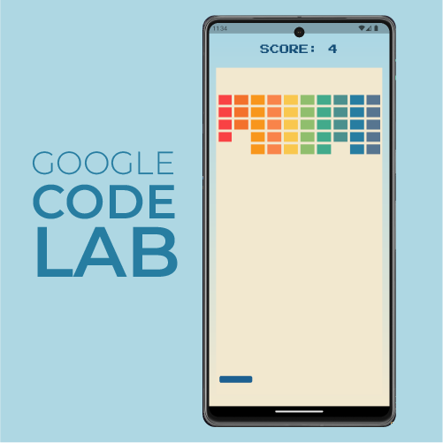

<<<<<<< HEAD
<<<<<<< HEAD
# brick_breaker

A new Flutter project.
=======
# GoogleCodeLabFlutter
Google Code Lab Flutter Flame
>>>>>>> 8745f241037f3342038753d8ad3211e5e5a54197
=======
# 🧱 Brick Breaker - Flutter Game

Un juego tipo arcade desarrollado en Flutter usando el motor Flame 🚀

---

## 🎮 Gameplay

---

## 🚀 Tecnologías utilizadas
- Flutter 💙
- Flame Engine 🔥
- Dart 🎯

---

## 📸 Capturas del juego

---

## ✨ Descripción
Este proyecto es un clon del clásico Brick Breaker hecho como práctica de Flutter y desarrollo de videojuegos 2D.

---

## 👨‍💻 Autor
Carlos Saltos
>>>>>>> 48fddc30dc50c96078dc6e58dfc4888ad09905e4
